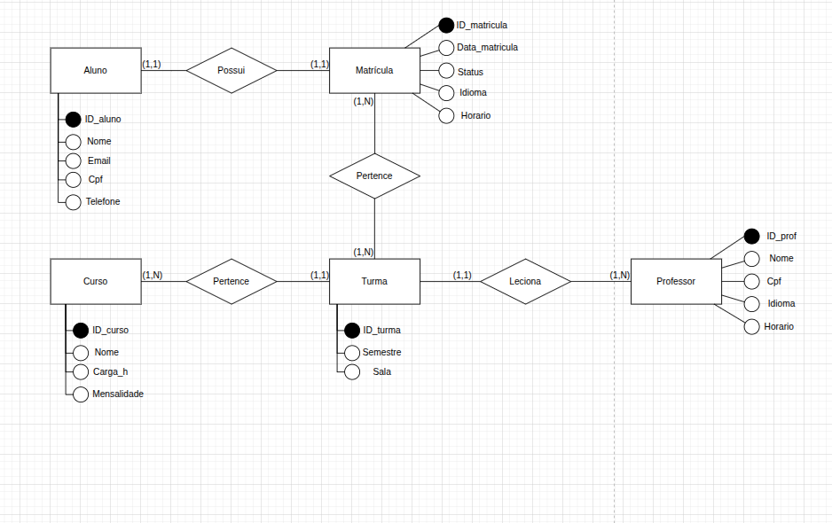
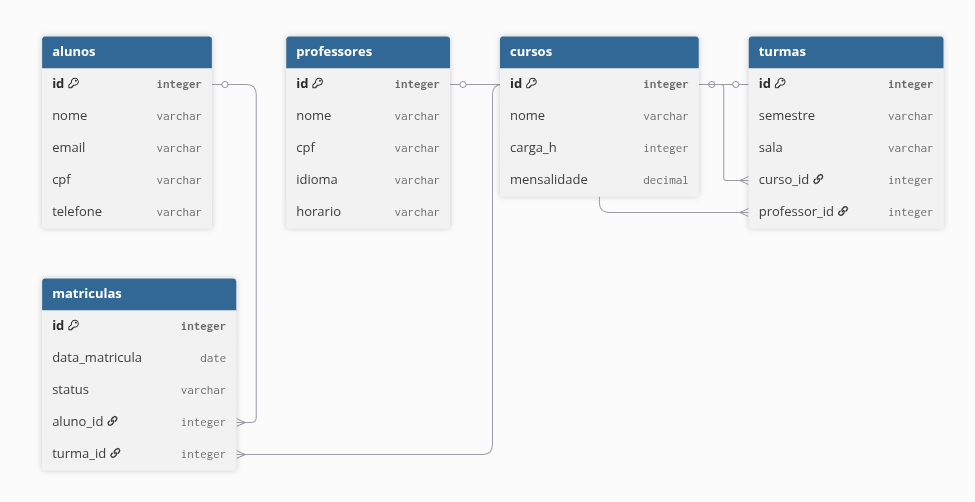

# SISTEMA DE UMA ESCOLA DE IDIOMAS

Resposta da primeira atividade do workshop de dados 2026.1 .Nessa atividade fomos instruídos a criarmos modelos de E-R dos tipos: Conceitual, lógico e físico.

## MODELAGEM

Aqui são apresentados os três modelos

### 1. Modelo conceitual

### 2. Modelo Lógico

### 3. Modelo Físico
O script SQL está localizado na pasta [Modelo_fisico](./Modelo_fisico/Modelo_fisico.sql)

## Rodando o projeto
1. Instale o **PostgreSQL** e o **pgAdmin**.
2. Crie um novo banco de dados no pgAdmin.
3. Abra a ferramenta de Query (`Query Tool`).
4. Copie o conteúdo do arquivo `modelo_fisico.sql` e execute-o.

## Tecnologias Utilizadas
* [PostgreSQL](https://www.postgresql.org/)
* [pgAdmin 4](https://www.pgadmin.org/)
* [brModeler](http://www.brmodeler.org/)